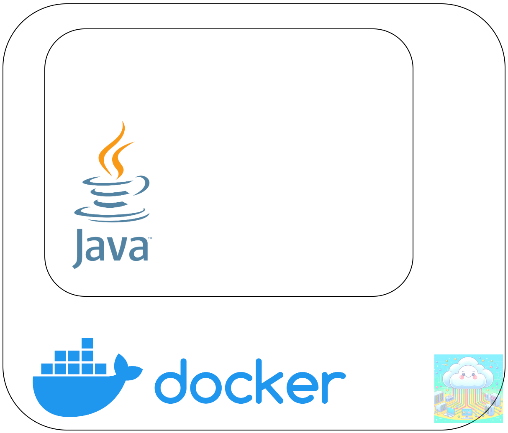

> In this tutorial, let's create a simple Docker container of a spring boot REST java application using a Dockerfile. The process mentioned in the article will also help to create reusable and redistributable code image.

## What this tutorial will have ? 🤔:
- Docker Java container with dynamic arguments
- Image creation of spring boot rest Java application
- Reusable container creation from locally hosted image
- A GitHub link of all the code I used in this post.
- One of the reason to use such container images in production environment.


___

### Prerequisites ✅ :
- JDK 17 (I am using AWS corretto 17)
- Maven 3.x
- Docker or Podman (just CLI is enough)
- Linux/macOS is preferred, but Windows is fine too.

### Why spring is used in this example?

_Because historically, when there were not many web frameworks, people used to prefer spring MVC/ spring boot. Even when there are plenty of better frameworks available in this era, spring is still used in legacy application as well as it has large community support than most JVM based web framework._

Before we proceed, I would like to gently encourage you to have a basic understanding of Docker and containers. If you feel you'd like to learn more, I have a post that offers some helpful insights. Please feel free to take a look at it when you have the time, here is the link ⬇️
https://rovingdev.com/p/unlocking-docker-a-beginners-guide

### Let's have a look at code. 🧐
I created a really simple REST service in Java with the help of spring boot.
This is the directory structure of the code:
```shell
.
├── Dockerfile
├── README.md
├── pom.xml
└── src
    └── main
        ├── java
        │   └── com
        │       └── example
        │           └── spring_demo
        │               └── SpringDemoApplication.java
        └── resources
            └── application.properties
```

```java
package com.example.spring_demo;

import org.springframework.boot.SpringApplication;
import org.springframework.boot.autoconfigure.SpringBootApplication;
import org.springframework.web.bind.annotation.GetMapping;
import org.springframework.web.bind.annotation.RequestParam;
import org.springframework.web.bind.annotation.RestController;

@SpringBootApplication
@RestController
public class SpringDemoApplication {

    public static void main(String[] args) {
        SpringApplication.run(SpringDemoApplication.class, args);
    }

    @GetMapping("/hello")
    public String hello(@RequestParam(value = "name",
            defaultValue = "World") String name) {
        return String.format("Hello %s!", name);
    }

    @GetMapping("/")
    public String defaultLanding() {
        return "Hello from Docker";
    }

}
```
### URL mappings:

- / : default is mapped to defaultLanding(), this will simply return 'Hello from Docker'
- /hello :
    - is mapped to hello(), this will return extract value from URL parameter name and append to Hello string
    - Example: /hello?name=ABCD will return 'Hello ABCD!'

### Dockerfile contents:
```shell
FROM docker.io/maven:3.9-eclipse-temurin-17 as base

LABEL org.opencontainers.image.authors="https://github.com/sukumaar"

ARG jar_file_name=*.jar

ARG arg_port=8080

ENV env_port=$arg_port

ENV HOME /

COPY ${jar_file_name} /runnable-jar.jar

ENTRYPOINT ["java","-jar","/runnable-jar.jar","--server.port=${env_port}"]
```

- Look carefully at line 1, we are using maven:3.9-eclipse-temurin-17 as base image. We are using Eclipse Temurin 17 as JDK, this is the open source Java SE build based upon OpenJDK. This has GPLv2 with Classpath Exception license, which makes commercial use easy.
- At line 5, we have created jar_file_name with default value, we are going to override this while building docker image. We will provide actual path of the jar file.
- At line 9, we have created env_port as an environmental variable, this will be useful to provide a dynamic parameter at the time of running docker container.

### Commands 💻 :
- These are sample commands to build Dockerfile and run container:
- 
```shell
mvn clean compile package
java -jar target/spring-demo-0.0.1-SNAPSHOT.jar --server.port:8010
docker build --build-arg jar_file_name=target/spring-demo-0.0.1-SNAPSHOT.jar -t spring-docker-demo .
docker run -e "env_port=8087" -p 8008:8087 localhost/spring-docker-demo
```
- 1st line in above code is used to compile and generated final jar
- 3rd line is used to test if the code is working fine or not, once you enter this command the REST service will be available at `http://localhost:8010`. It is running at the port 8010 as we specified `—-server.port:8010`
- Once you are done with the testing, you can kill it by CTRL + c or CMD + c.
- 5th line
    - builds docker image with the JAR file from target directory, and tag it with spring-docker-demo.
    - We also override the jar_file_name argument with actual jar file path that we built in previous stage.
- You can check if image got created or not by entering docker image list command, this will list all local images.
- 7th line
    - will start the docker container with the JAR file.
    - while starting the container, we have provided value to env_port,this will detect the port for the REST service running inside the container.
    - -p 8008:8087 will do port forwarding between docker host port (8008) and docker container port (8087).
- That's all.

_FYI, I used a Linux machine (Ubuntu 24.04) to run the above commands._

### Why you should prefer using Docker images for production ? ⚙️
- Docker images encapsulate applications and their dependencies in a consistent environment, ensuring reliable and predictable production deployments.
- This promotes reusability across different environments, as images can be easily shared and version-controlled, reducing conflicts and streamlining updates. Overall, they enhance scalability and simplify the deployment process, leading to faster and more efficient software delivery.
- This is applicable with [OCI images](https://opencontainers.org/).

