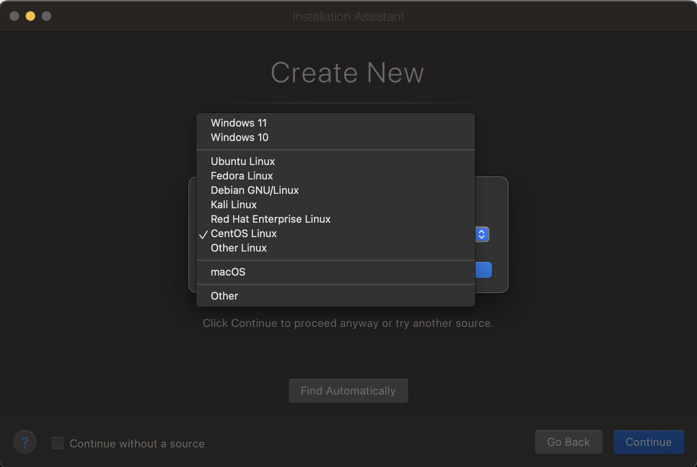

_**Audience consideration for this tutorial:** Someone who wants to test the code on local Kubernetes cluster and has Apple Mac devices with Apple Silicon._
## Prerequisite:
- Apple Mac machine 💻 / 🖥️
- Parallels Desktop (non-pro version will also work)
- Some free storage on your SSD
## Steps 🛠️:
- Create a Linux VM
- Install prerequisites in the Linux VM
- Install Kubernetes (Let's call it k8s henceforth) and related applications for the k8s deployment.
- Cluster creation
### Step 1:
- Download the rocky linux (a clone of RHEL). Here is the download link of rocky 9 for arm64 architecture (i.e. for Apple Silicon).
- Create a linux VM by following this guide: Install Linux virtual machine on a Mac with Apple M-Series chip .
- While installing, please select OS type as Red Hat Enterprise Linux / CentOS Linux. 
Like this:

- Proceed with further process of the OS installation.
### Step 2:
- Start the vm and then install prerequisites with below commands
- 
```shell
sudo dnf install openssh-server
ip address # note down the ip address
```
- PS: Please use the host IP address noted from above command to ssh the vm. It will be easy to just copy and paste commands from below section.
### Step 3:
- Install required libraries 👇 , GitHub link 🔗 for commands : [k8s-kind-podman-installation-command.sh](https://gist.github.com/sukumaar/917f90dcfa88f5c297bb2754bbd05a41)
```shell
sudo dnf check-update -y
sudo dnf update -y 
sudo dnf update --security  -y
sudo dnf groupinstall 'Development Tools' -y
sudo dnf install nano
dnf install go -y

# this will install podman, we are using podman instead of docker
dnf install podman -y

#this will install kubernetes
curl -LO "https://dl.k8s.io/release/$(curl -L -s https://dl.k8s.io/release/stable.txt)/bin/linux/arm64/kubectl"
curl -LO "https://dl.k8s.io/release/$(curl -L -s https://dl.k8s.io/release/stable.txt)/bin/linux/arm64/kubectl.sha256"
echo "$(cat kubectl.sha256)  kubectl" | sha256sum --check
sudo install -o root -g root -m 0755 kubectl /usr/local/bin/kubectl
kubectl version --client
dnf install bash-completion -y
source /usr/share/bash-completion/bash_completion
echo 'source <(kubectl completion bash)' >>~/.bashrc
source ~/.bashrc

#this will install kind, this is better alternative to minikube
[ $(uname -m) = aarch64 ] && curl -Lo ./kind https://kind.sigs.k8s.io/dl/v0.22.0/kind-linux-arm64
chmod +x ./kind
sudo mv ./kind /usr/local/bin/kind
kind # to check the installation

#install related applications
curl -fsSL -o get_helm.sh https://raw.githubusercontent.com/helm/helm/main/scripts/get-helm-3
chmod 700 get_helm.sh
./get_helm.sh
helm repo add kubernetes-dashboard https://kubernetes.github.io/dashboard/
#install kompose to convert docker-compose.yml to k8s manifest yml files
curl -L https://github.com/kubernetes/kompose/releases/download/v1.26.0/kompose-linux-arm64 -o kompose
chmod +x kompose
sudo mv ./kompose /usr/local/bin/kompose
```
### Step 4:
- Create cluster through kind
-
```shell
kind create cluster # default cluster is name is kind
kubectl cluster-info # check k8s cluster info
#or
kubectl cluster-info --context kind-kind
podman ps # check podman status
```
Now you can use this cluster as any other normal testing k8s cluster. 😀😀