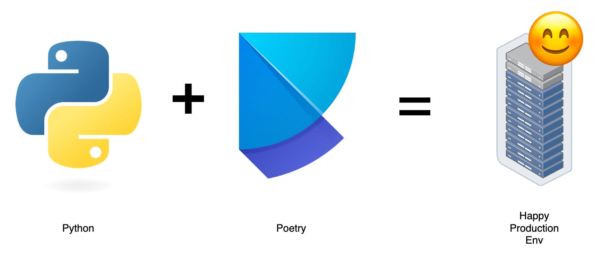

> On a Friday evening, a Python team deployed updates using requirements.txt, only to face a production crash caused by untracked transitive dependency changes. Debugging revealed mismatched local environments, unpinned versions, and undocumented Python constraints.
>
> Rollback attempts failed due to a breaking change in another dependency, and onboarding new developers was already chaotic. Dependency drift across staging and production led to unpredictable failures, forcing the team into a weekend firefight. They realized the lack of a lockfile and proper dependency management with requirements.txt had caused critical downtime—and vowed to switch to Poetry.

### What this tutorial will have ? 🤔:
1. What is Poetry
2. Similarities with Maven
3. Why it is superior to requirements.txt

## Poetry:
1. Poetry is a tool used to manage and organize the various components required to build and run a python application. It's essentially a way to ensure that all the necessary pieces are in place and working together seamlessly.

2. Imagine building a house. You need various materials like bricks, cement, and wood, and you need to ensure that they are all the right quality and quantity. You also need to make sure that they are all delivered to the construction site at the right time. This is similar to what Poetry does, but instead of building a house, it's helping to build a software application.


> Poetry official logo

### Poetry takes care of the following tasks:
* It ensures that all the necessary components, or "dependencies," are installed and up-to-date.
* It manages the different versions of these components, so that the application can work correctly.
* It provides a way to easily reproduce the exact same environment on different machines, which is important for testing and deployment.

Poetry is a modern, all-in-one tool for managing Python projects, designed to address common challenges in dependency management, virtual environments, and project packaging. Unlike traditional workflows that rely on pip, setup.py, and requirements.txt, Poetry simplifies and unifies these processes. It also simplifies publishing to repositories.

### Sample Code:
This example creates a python project which will have a library function for conversion of parquet file to JSON file. This can also be run independently at CLI by accepting input path of parquet file and output path to store JSON file.

### Prerequisites:
* I tested code on an environment with below versions.
```shell
Python 3.9.x
git 2.x
pip 22.x
```
### Installation:
```shell
pip install pipx
pipx install poetry
poetry config virtualenvs.in-project true
```
`virtualenvs.in-project true` will create `.venv` inside project, this will make life of IDEs easier and can easily identify project dependencies via project virtual env.

### Project Creation:
* poetry new `<project_name>`
    * I am creating a project with name parquet_to_json_example, so I will use command: poetry new parquet_to_json_example
    * This command creates a directory with default values in pyproject.toml
* cd project_name
    * change directory, move into the newly created directory
    * I will use cd parquet_to_json_example
* Update pyproject.toml, below is the example :
```shell
[tool. poetry]
name = "parquet2json"
version = "0.1.0"
description = ""
authors = ["sukumaar"]
readme = "README.md"

packages = [include = "parquet2json" }]

[tool.poetry.dependencies]
python = "^3.13"
polars = "1.18.0"
argparse = "1.4.0"

[build-system]
requires = ["poetry-core=1.9.1"]
build-backend = "poetry.core.masonry.api"

[tool.poetry.scripts]
parquet2json = 'parquet2json.__main__:main'
```

* dependencies needs to mention under [tool.poetry.dependencies]
* Check line no.19,
    * entry point need to mention to run this code directly via CLI, it is possible by mentioning script name and function to run.
    * as per format, it needs to mention under [tool.poetry.scripts]
    * Explanation:
    * 
    ```shell
    parquet2json = 'parquet2json.__main__:main'
        ^               ^           ^       ^
    script name     package name  module function
    ```

### Project directory structure:
```shell
parquet_to_json_example
├── LICENSE
├── README.md
├── parquet2json
│   ├── __init__.py
│   ├── __main__.py
│   └── converter
│       ├── __init__.py
│       └── parquet_to_json.py
├── pyproject.toml
└── tests
    └── __init__.py
```
### Poetry Commands:
* `poetry add <packageName>` , to add new dependencies from CLI, more details here
* `poetry remove <packageName>` , to remove dependencies from CLI, more details here
* `poetry install` , this fetches all dependency and create `poetry.lock`, run this only on first time.
* `poetry update` , updates the dependencies after adding/removing dependency.
* `poetry build` , builds distributable packages (wheel / tar.gz )
* `poetry shell` ,this will start a shell within the project's virtual environment.

### Command for this project:
* After installing poetry, below commands will install parquet_to_json_example project
```shell
## git clone, and build
git clone gitagithub.com:sukumaar/parquet_to_json_example.git

cd parquet_to-json_example
poetry config virtualenvs. in-project true poetry install
poetry build #packages will be created under dist/

## test, change path-to-project to correct path
cd ~
mkdir test
cd test

pip uninstall parquet2json -y
pip install --no-cache-dir path-to-project/dist/parquet2json-o.1.0-py3-none-any.whl

## use like below
parquet2json -h # for help 
parquet2json --i "path/to/parquet" --o "path/for/json"
```
_Sounds similar to Maven from Java world ?_

### Similarities between Poetry (Python) and Maven (Java) :
By looking at above tutorial you could think that there are many similarities between poetry and maven, some of them are listed below:
* **Package managers:** They manage dependencies and libraries for their respective languages.
* **Build automation tools:** They automate the build process, making it easier to manage and deploy projects.
* **Dependency resolvers:** They resolve dependencies and ensure that all required libraries are installed and up-to-date.
* **Used for project management:** They provide a standardized way to manage projects, making it easier to collaborate and share code.

> But my team uses requirements.txt why should I look into other solutions ?

### Features of Poetry and why it is better than requirements.txt:
* Dependency Management: Poetry handles both direct and transitive dependencies, ensuring a lockfile (poetry.lock) for reproducible environments.
* Simplified Workflow: Combines dependency installation, packaging, and publishing in one tool, streamlining development.
* Semantic Versioning: Supports intuitive dependency version constraints (e.g., ^1.0), making upgrades safer.
* Virtual Environments: Automatically manages virtual environments without additional tools.
* Project Metadata: Uses pyproject.toml for unified configuration, adhering to PEP 518.
* Build and Publishing: With built-in tools for packaging and publishing to PyPI, Poetry eliminates the need for separate tools like setuptools .
* In contrast, requirements.txt lacks dependency locking, automated environment management, and higher-level project tooling, built-in venv support.



## Why Poetry Matters for Large Organizations
Poetry should be preferred in large teams. Implementing Poetry can significantly benefit large organizations, especially those with numerous developers working on critical projects. Here are some key reasons:
1. Enhanced Collaboration 🤝
    1. Consistency Across Teams
    2. Easier Onboarding
2. Simplified Dependency Management 📦
    1. Automatic Resolution
    2. Version Control
    3. Easy Dependency Management
3. Streamlined Project Setup 🛠️
    1. Quick Start, poetry simplifies the setup process for new projects
    2. Unified Configuration
    3. Reproducibility
4. Deployment Made Easy ⚙️
    1. One Command Installation
    2. Rollback Capabilities

