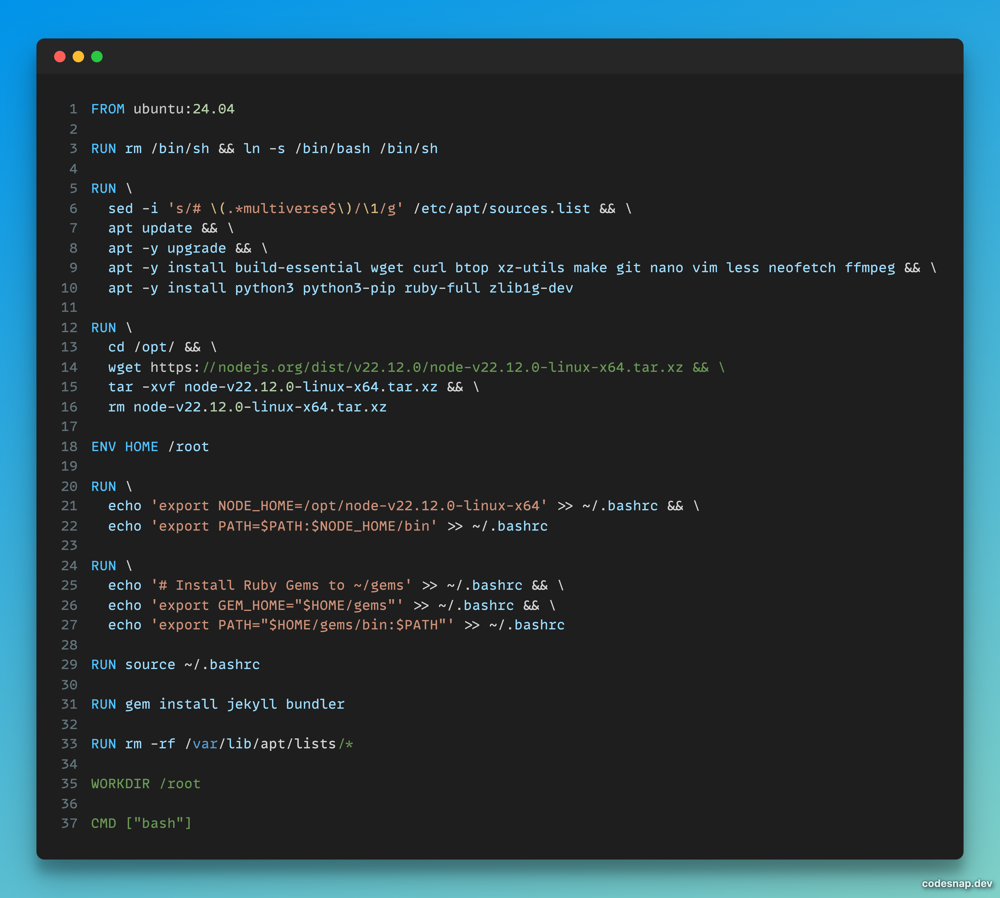

>In this tutorial, let's create a simple Docker container of Ubuntu and Node.js using a Dockerfile. This base Dockerfile will serve as a starting point for building custom Docker images. By leveraging this Dockerfile, we can automate the process of creating a standardized Ubuntu environment for our applications.

### What this tutorial will have ? 🤔:
- Installation of packages via default package manager (apt)
- Installation of application (Node.js) via precompiled binaries (tar.xz)
- Editing .bashrc file
___
### Docker 101, what it is ? 🤓:
- Docker is a tool that helps developers package applications and all their necessary parts into a single container. Think of it like a lunchbox that holds a complete meal, so it can be easily transported and served anywhere.
- This makes it simpler to run the application on different computers without worrying about missing ingredients. It helps ensure everything works smoothly in various environments. Overall, Docker makes software sharing and deployment more efficient and hassle-free.
### Docker vs Virtual Machines :
- Whatever Docker is doing sometimes looks like what a typical VM does, but there are many differences. The big difference is containerization.
- Docker and virtual machines (VMs) are both ways to run software in separate environments on a computer.
- Docker uses a lightweight method to package applications, allowing them to share the same operating system and resources, which makes it faster and uses less space.
- In contrast, virtual machines create an entire separate computer environment, including its own operating system, which takes up more space and uses more resources.
- This means Docker is typically quicker to start and more efficient for running applications. However, VMs provide greater isolation and can run different operating systems at the same time.
### Let's get into code 🛠️ :
_Prerequisites: [Docker](https://docs.docker.com/engine/install/) has to be installed beforehand._

This is what my Dockerfile is looking like:

- Look at line no. 3, if you do not set it then you can not perform source ~/.bashrc (line no. 29). If you can source your .bashrc then you can not use the libraries/tools/applications that you made available via "$PATH" variable.
- This is an example commands to build Dockerfile and run container:
```shell
git clone https://github.com/sukumaar/docker-ubuntu-base.git
cd docker-ubuntu-base
docker build -t docker-ubuntu-base:1  .
docker run -it localhost/docker-ubuntu-base
```
- After last the command, you will enter the container.
- To exit the container, type exit and hit enter.
- To check if your container is terminated or not, you can use this command: docker ps
- That's all.