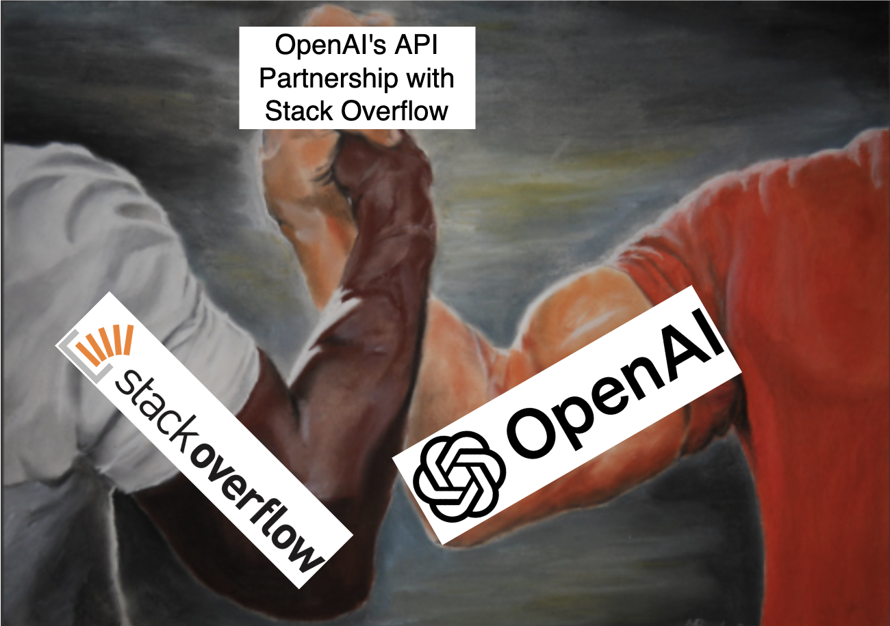
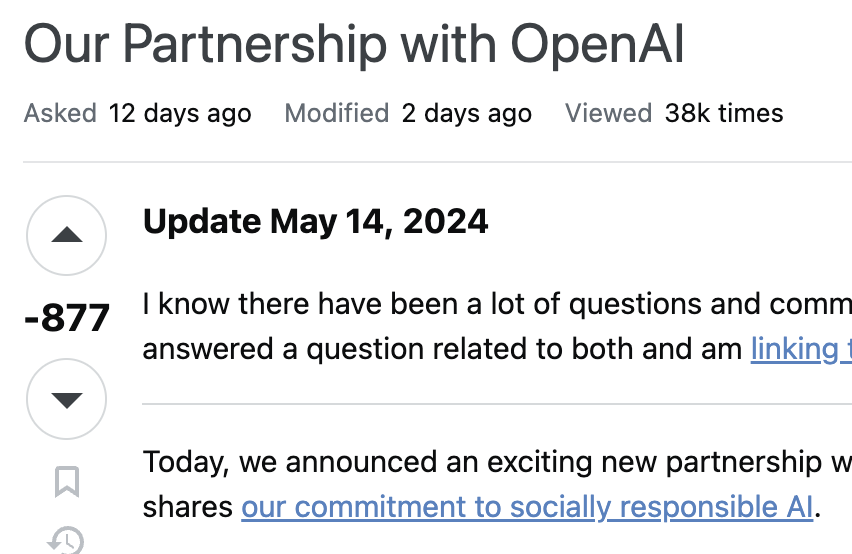
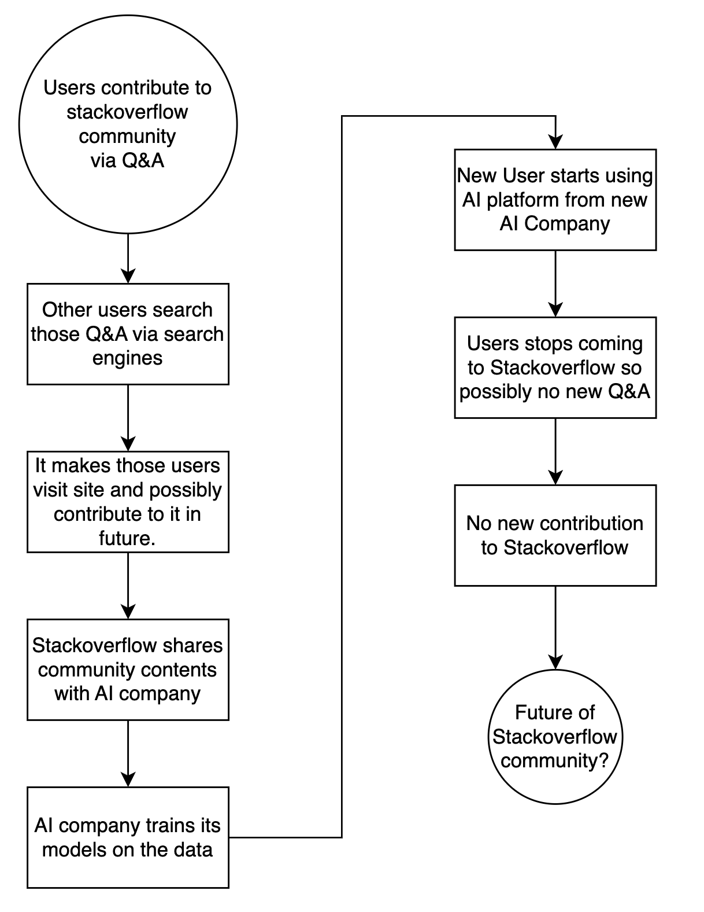

This news came out on May 6, 2024 🗓️:
> Stack Overflow and OpenAI today announced a new API partnership that will empower developers with the collective strengths of the world's leading knowledge platform for highly technical content with the world's most popular LLM models for AI development. Here 🔗 : https://openai.com/index/api-partnership-with-stack-overflow/

___
## What it means 🤔?
- Stack Overflow and OpenAI have partnered to help developers by combining Stack Overflow's coding expertise with OpenAI's advanced AI models. Here read coding expertise as the questions and answers contributed to Stack Overflow by developers/ programmers from all over the world with their free will.
- These contributions are from a variety of languages and frameworks. Developers have been contributing for more than a decade, were not aware that this data sharing partnership would ever happen.

> This is just a meme
___
Community contributing developers might have surprised and startled due to sharing of their hard work to third party [without consent of the original authors of the questions or answers](https://www.theverge.com/2024/5/8/24151906/stack-overflow-ai-protest-posts-deleted-restored).

## In retaliation, what developers did 😐?
- Developers started revolting against Stack Overflow. [Some of them seems not happy with it](https://ca.news.yahoo.com/developers-really-not-happy-openai-101401197.html?guccounter=1).
- Deleted their highest rated answers from Stack Overflow 😱.
- Deleted their profile from Stack Overflow.
- There is an Q and A on Stack Overflow meta regarding OpenAI partnership that question has 877 downvotes as of 18th May 2024 🤯. This is the lowest rated answer I have ever seen on the Stack Overflow. Link here: https://meta.stackexchange.com/questions/399619/our-partnership-with-openai
- Screenshot of above link:

- One of the concern developers have is attribution, as most LLM's do not provide attribution to any of the answer they provide to the user.
- Stack Overflow started banning / suspending account of such community contributors 🥲. [link1](https://www.bleepingcomputer.com/news/technology/stack-overflow-suspends-user-for-editing-posts-in-openai-protest/), [link2](https://www.theregister.com/2024/05/09/stack_overflow_banning_users_who/), [link3](https://www.zdnet.com/article/stack-overflow-could-suspend-your-account-if-you-change-a-post-to-protest-openais-deal/), [link4](https://futurism.com/the-byte/stack-overflow-bans-users-openai-training-data).

## What could be the possible future of the Stack Overflow 🤓?
- There were so many user communities past which ended due to lack of any contribution.
- In developer communities, the typical ways of contributing is via documentation, questions, answers, tutorials, notes.
- Will something like below happen with Stack Overflow community in future? What are your thoughts on it ?
- Whatever written in below flow diagram could be just speculation, it might even never happen.
