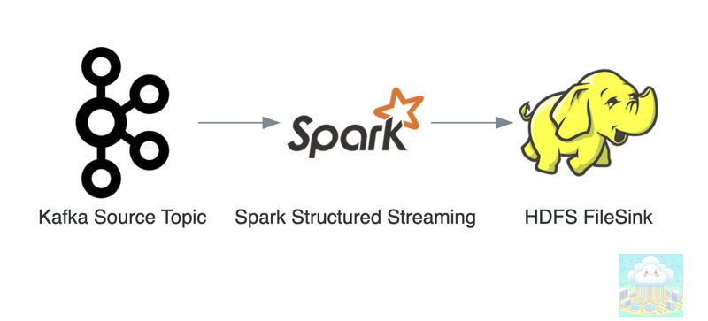

>Spark Structured Streaming is a real-time data processing framework in Apache Spark. It enables continuous, scalable, and fault-tolerant data ingestion, transformation, and analysis from various sources, like Kafka or files.
>Unlike traditional batch processing, it treats data as an unending stream, allowing for low-latency analytics. Queries are expressed using familiar SQL or DataFrame API, making it user-friendly. It provides built-in support for event-time processing and ensures exactly-once processing semantics, making it suitable for various real-time applications like monitoring, ETL, and more.


**In this article**, we'll explore a critical component of Spark Structured Streaming: the _spark_metadata directory.
___

In this article, we will assume the nature of streaming jobs as:
```shell
Apache Kafka -> Apache Spark -> Apache Hadoop(HDFS)
```


### What is _spark_metadata Directory?
- Every spark structured streaming job creates _spark_metadata directory in the destination file sink. This file sink could be any supported file system e.g. HDFS,GCS,S3,etc. .
- This directory is specifically used for metadata management.
- It manages the metadata of the spark structured streaming job that is writing to that path.
- _spark_metadata directory is not sharable among jobs, there is only one directory per job.
- _spark_metadata directory prevents writing from more than one spark structured streaming job at the same location, and this behaviour happens by design.
- This directory will get created inside the output path.
- This directory contains write-ahead logs for every batch run. This is how Spark can guarantee exactly-once when writing to a file sink.
- For example: If the spark streaming job is writing to hdfs://tmp/landing/streaming_store/ then _spark_metadata will by default be created at hdfs://tmp/landing/streaming_store/_spark_metadata/

### How to run multiple structured streaming jobs for the same output path?
- You can not (last checked in Apache Spark 2.3). Due to the mere presence of _spark_metadata directory.
- Even if you start multiple structured streaming jobs, only the first started job can write to the destination path. Other subsequent jobs will not write as well as not fail if failOnDataLoss option is set to false, this option is true by default. (Assumption is we are reading/consuming from Apache Kafka).
- The path of this directory is unchangeable, it is hard coded.
- FileStreamSink is the class used while writing stream to supported file systems like HDFS/S3/GCS and so forth, see [code](https://github.com/apache/spark/blob/v2.3.0/sql/core/src/main/scala/org/apache/spark/sql/execution/streaming/FileStreamSink.scala#L33) sample below:

```scala
package org.apache.spark.sql.execution.streaming

import scala.util.control.NonFatal

import org.apache.hadoop.conf.Configuration
import org.apache.hadoop.fs.Path

import org.apache.spark.internal.Logging
import org.apache.spark.internal.io.FileCommitProtocol
import org.apache.spark.sql.{DataFrame, SparkSession}
import org.apache.spark.sql.catalyst.expressions._
import org.apache.spark.sql.execution.datasources.{FileFormat, FileFormatWriter}

object FileStreamSink extends Logging {
// The name of the subdirectory that is used to store metadata about which files are valid.
val metadataDir = "_spark_metadata"
.
.
.
```

### Structure of _spark_metadata directory:
- It has files in incremental order for each batch, you can see file names as 0 / 1 / 2.
- If we list the files under directory, it may look something like this:
```shell
/tmp/landing/streaming_store/_spark_metadata/0
/tmp/landing/streaming_store/_spark_metadata/1
```
- If we cat the file, then it may look something like this:
```
$ hadoop fs -cat /tmp/landing/streaming_store/_spark_metadata/0
v1
{"path":"hdfs://tmp/landing/streaming_store/part-00000-34bdc752-70a2-310f-92dd-7ca9c000c34b-c000.snappy.parquet","size":2287,"isDir":false,"modificationTime":1616075186000,"blockReplication":1,"blockSize":33554432,"action":"add"}
```
### What will happen if you delete _spark_metadata directory?
- You will see exception `java.lang.IllegalStateException: /tmp/landing/streaming_store/_spark_metadata/0 doesn't exist when compacting batch <batchNumber>`
- Data loss will be unrecoverable.

**PS: 🚨 _spark_metadata should not be deleted at all. 🚨**
